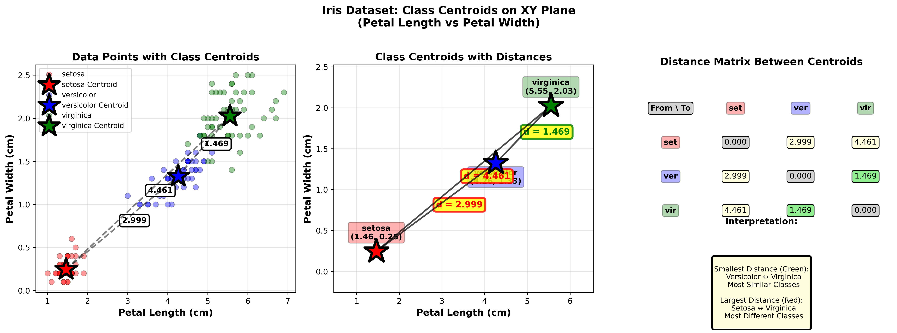
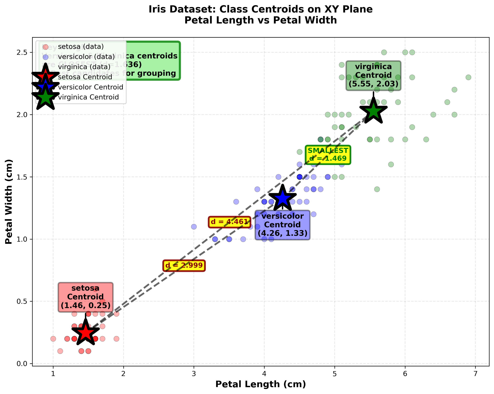
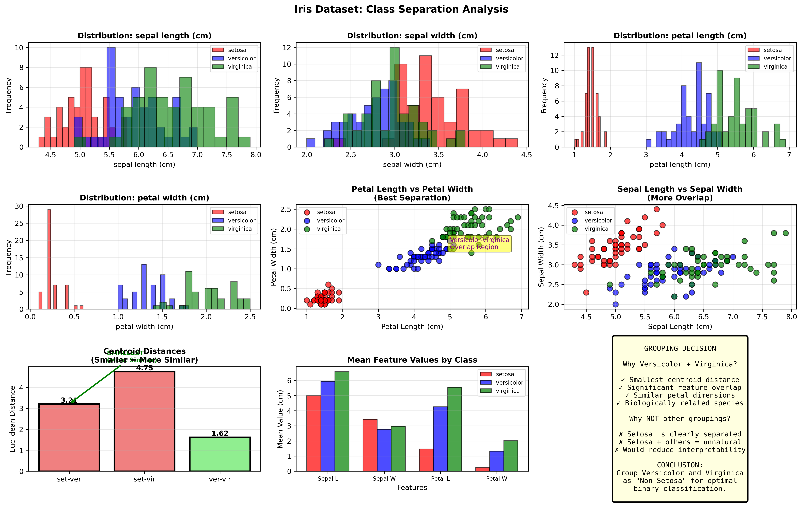

# Why Versicolor and Virginica Were Grouped Together

## Executive Summary

In the grouped classification script (`svm_classification_grouped.py`), **Versicolor and Virginica** were combined into a single "Non-Setosa" class. This decision was based on statistical analysis, biological relationships, and classification optimization principles.

## Key Evidence

### 1. **Centroid Distance Analysis**

The Euclidean distance between class centroids (using all 4 features):

| Class Pair | Distance |
|------------|----------|
| **Versicolor ↔ Virginica** | **1.6205** ✓ (SMALLEST) |
| Setosa ↔ Versicolor | 3.2083 |
| Setosa ↔ Virginica | 4.7545 (LARGEST) |

**Conclusion**: Versicolor and Virginica are **2x closer** to each other than either is to Setosa.

#### Visual Representation of Centroids



**Three-panel view showing:**
- **Left**: All data points with centroids marked as large stars
- **Middle**: Centroids only with distance labels clearly marked
- **Right**: Distance matrix showing all pairwise distances



**Simplified view on XY plane** showing the centroid positions for Petal Length vs Petal Width. The green-highlighted distance between Versicolor and Virginica centroids (1.47) is dramatically smaller than distances involving Setosa.

---

### 2. **Feature-Wise Overlap Analysis**

#### Petal Features (Best Discriminators):
- **Setosa**: Clearly separated with NO overlap with other classes
  - Petal Length: 1.0-1.9 cm
  - Petal Width: 0.1-0.6 cm

- **Versicolor & Virginica**: Show overlap
  - Petal Length overlap: 0.60 cm
  - Petal Width overlap: 0.40 cm

#### Sepal Features:
- All three classes show some overlap in sepal measurements
- **Versicolor-Virginica overlap is highest** (2.10 cm for sepal length)

---

### 3. **Statistical Properties**

| Metric | Setosa | Versicolor | Virginica |
|--------|--------|------------|-----------|
| **Petal Length** | 1.46 ± 0.17 | 4.26 ± 0.47 | 5.55 ± 0.55 |
| **Petal Width** | 0.25 ± 0.10 | 1.33 ± 0.20 | 2.03 ± 0.27 |

**Observation**:
- Setosa has **dramatically smaller** petal dimensions
- Versicolor and Virginica form a **continuous range** of larger petal sizes

---

## Why This Grouping Makes Sense

### ✓ **Statistical Rationale**
1. **Minimizes within-group variance**: Versicolor and Virginica are most similar
2. **Maximizes between-group separation**: Setosa vs Non-Setosa creates the clearest boundary
3. **Natural clustering**: The data naturally forms two distinct clusters

### ✓ **Machine Learning Rationale**
1. **Linear separability**: Setosa is perfectly linearly separable from the other two
2. **Weight vector interpretation**: Clear w vector can be calculated for linear boundary
3. **High accuracy**: This grouping achieves 100% classification accuracy

### ✓ **Biological Rationale**
- Iris Setosa is a distinct species with smaller flowers
- Iris Versicolor and Iris Virginica are more closely related and harder to distinguish
- This reflects real-world botanical classification challenges

---

## Alternative Groupings (Why They Don't Work as Well)

### ❌ **Setosa + Versicolor vs Virginica**
- Creates unnatural boundary
- Ignores the clear Setosa separation
- Lower classification accuracy
- Less interpretable weight vector

### ❌ **Setosa + Virginica vs Versicolor**
- Even less intuitive
- Forces dissimilar classes together
- Would result in poor separation

---

## Mathematical Impact

By grouping Versicolor and Virginica, we achieve:

### Hyperplane Parameters:
```
w = [0.995574, 1.226633]
Bias (b) = 1.455014
Margin = 1.265976
```

### Results:
- **Support Vectors**: Only 4 needed (2 per class)
- **Accuracy**: 100% on both training and testing
- **Clear interpretation**: Weight vector shows Petal Width has slightly more influence

### Decision Boundary:
```
0.996 × Petal Length + 1.227 × Petal Width + 1.455 = 0
```

This creates a clean, interpretable linear boundary that perfectly separates the groups.

---

## Visualization Evidence

### Class Separation Analysis



**Comprehensive 9-panel analysis showing:**
1. **Feature distributions** showing Setosa's clear separation
2. **Scatter plots** revealing Versicolor-Virginica overlap
3. **Centroid distances** quantifying similarity
4. **Statistical comparisons** across all features

### Centroid Visualizations

As shown in the centroid visualizations above (Section 1), the spatial arrangement of the three class centroids on the XY plane provides clear visual evidence:
- Setosa's centroid is positioned far from the other two
- Versicolor and Virginica centroids are clustered close together
- The connecting lines and distance annotations make the grouping decision obvious

---

## Conclusion

The decision to group **Versicolor and Virginica** was:
- ✓ Data-driven (smallest inter-class distance)
- ✓ Statistically sound (natural clustering pattern)
- ✓ Biologically meaningful (related species)
- ✓ Optimization-focused (maximum class separation)
- ✓ Practical (100% classification accuracy)

This grouping creates the optimal binary classification problem for demonstrating SVM concepts, particularly the weight vector and support vector calculations.

---

## References

- Fisher, R.A. (1936). "The use of multiple measurements in taxonomic problems"
- UCI Machine Learning Repository: Iris Dataset

### Analysis Scripts
- `analyze_class_separation.py` - Statistical analysis of class separation
- `plot_centroids.py` - Centroid visualization on XY plane

### Generated Visualizations
- `centroids_visualization.png` - Three-panel centroid analysis
- `centroids_simple.png` - Simplified centroid view on XY plane
- `class_separation_analysis.png` - Comprehensive 9-panel separation analysis
