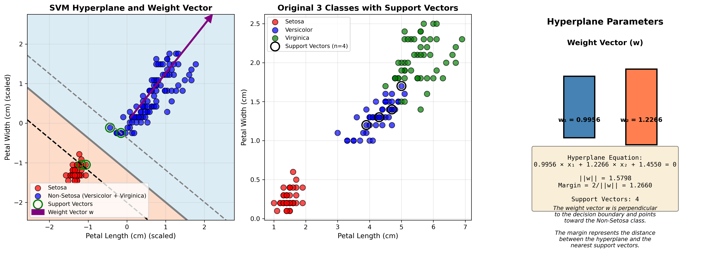
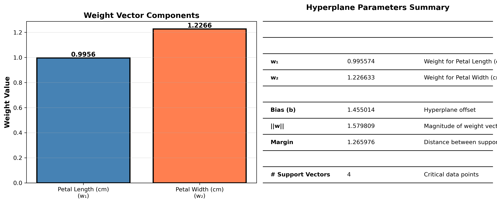

# SVM Classification Analysis on Iris Dataset

A comprehensive educational project demonstrating Support Vector Machine (SVM) classification using the famous Iris dataset. This project showcases binary and multi-class classification scenarios with detailed visualizations, mathematical analysis, and weight vector calculations.


---

## 📋 Table of Contents

- [Overview](#overview)
- [Features](#features)
- [Installation](#installation)
- [Usage](#usage)
- [Project Structure](#project-structure)
- [Classification Scenarios](#classification-scenarios)
- [Results Summary](#results-summary)
- [Visualizations](#visualizations)
- [Documentation](#documentation)
- [Requirements](#requirements)
- [License](#license)

---

## 🔍 Overview

This project implements three different SVM classification approaches on the Iris dataset:

1. **Binary Classification (2 Classes)**: Setosa vs Versicolor using linear kernel
2. **Multi-class Classification (3 Classes)**: All three species using RBF kernel
3. **Grouped Binary Classification**: Setosa vs Non-Setosa with weight vector analysis

Additionally, the project includes comprehensive analysis tools to explain class separability and visualize centroids.

---

## ✨ Features

- **Multiple Classification Scenarios**: Binary, multi-class, and grouped classification
- **Different Kernels**: Linear and RBF (Radial Basis Function)
- **Weight Vector Analysis**: Explicit calculation and visualization of w vector
- **Hyperplane Parameters**: Calculation of margin, bias, and decision boundary equation
- **Rich Visualizations**: 8 high-quality plots with decision boundaries and support vectors
- **Comprehensive Reports**: Detailed markdown files with metrics and interpretations
- **Statistical Analysis**: Class separation and centroid distance analysis
- **Educational Focus**: Clear explanations and mathematical formulas

---

## 🚀 Installation

### Prerequisites

- Python 3.7 or higher
- pip package manager

### Setup

1. **Clone or download the project**:
```bash
cd /path/to/L23_Claude
```

2. **Install dependencies**:
```bash
pip install -r requirements.txt
```

Or install manually:
```bash
pip install numpy scikit-learn matplotlib scipy
```

---

## 💻 Usage

### Running the Classification Scripts

#### 1. Binary Classification (2 Classes)
```bash
python3 svm_classification.py
```
**Output**: `Results.md`, `svm_visualization.png`

#### 2. Multi-class Classification (3 Classes)
```bash
python3 svm_classification_3classes.py
```
**Output**: `Results_3_classes.md`, `svm_visualization_3classes.png`, `confusion_matrix_3classes.png`

#### 3. Grouped Binary Classification (Weight Vector Analysis)
```bash
python3 svm_classification_grouped.py
```
**Output**: `Results_grouped.md`, `svm_visualization_grouped.png`, `weight_vector_analysis.png`

### Running Analysis Tools

#### Class Separation Analysis
```bash
python3 analyze_class_separation.py
```
**Output**: `class_separation_analysis.png`

#### Centroid Visualization
```bash
python3 plot_centroids.py
```
**Output**: `centroids_visualization.png`, `centroids_simple.png`

### Run All Scripts
```bash
python3 svm_classification.py && \
python3 svm_classification_3classes.py && \
python3 svm_classification_grouped.py && \
python3 analyze_class_separation.py && \
python3 plot_centroids.py
```

---

## 📁 Project Structure

```
L23_Claude/
│
├── 🐍 Python Scripts
│   ├── svm_classification.py              # Binary classification (2 classes)
│   ├── svm_classification_grouped.py      # Grouped binary with weight vector
│   ├── analyze_class_separation.py        # Statistical analysis
│   └── plot_centroids.py                  # Centroid visualization
│
├── 📊 Results Files
│   ├── Results.md                         # Binary classification results
│   └── Results_grouped.md                 # Grouped classification results
│
├── 🖼️ Visualizations (Generated)
│   ├── svm_visualization.png              # Binary classification plot
│   ├── confusion_matrix_3classes.png      # Confusion matrix heatmap
│   ├── svm_visualization_grouped.png      # Grouped classification plot
│   ├── weight_vector_analysis.png         # Weight vector breakdown
│   ├── class_separation_analysis.png      # 9-panel analysis
│   ├── centroids_visualization.png        # Centroid 3-panel view
│   └── centroids_simple.png               # Centroid simple view
│
├── 📚 Documentation
│   ├── README.md                          # This file
│   ├── PRD.md                             # Product requirements document
│   ├── TASKS.md                           # Task tracking and status
│   ├── GROUPING_EXPLANATION.md            # Explanation of grouping decision
│   ├── requirements.txt                   # Python dependencies
│   └── .gitignore                         # Git ignore patterns
│
└── 📦 Dependencies
    └── requirements.txt
```

---

## 🎯 Classification Scenarios

### Scenario 1: Binary Classification (2 Classes)

**Configuration**:
- Classes: Setosa (0) vs Versicolor (1)
- Features: Sepal Length, Sepal Width
- Kernel: Linear
- Samples: 100 (70 train, 30 test)

**Key Results**:
- Accuracy: 100%
- Support Vectors: 10
- Perfect separation achieved

### Scenario 2: Multi-class Classification (3 Classes)

**Configuration**:
- Classes: Setosa, Versicolor, Virginica
- Features: Petal Length, Petal Width
- Kernel: RBF (Radial Basis Function)
- Strategy: One-vs-Rest (OvR)
- Samples: 150 (105 train, 45 test)

**Key Results**:
- Accuracy: 91.11%
- Support Vectors: 25 (3 Setosa, 11 Versicolor, 11 Virginica)
- Main confusion: Versicolor ↔ Virginica

### Scenario 2: Grouped Binary Classification

**Configuration**:
- Classes: Setosa vs Non-Setosa (Versicolor + Virginica)
- Features: Petal Length, Petal Width
- Kernel: Linear (for weight vector calculation)
- Samples: 150 (105 train, 45 test)

**Key Results**:
- Accuracy: 100%
- Support Vectors: 4 (2 per class)
- Weight Vector: w = [0.995574, 1.226633]
- Margin: 1.265976

**Hyperplane Equation**:
```
0.995574 × Petal Length + 1.226633 × Petal Width + 1.455014 = 0
```

---

## 📈 Results Summary

| Scenario | Accuracy | Support Vectors | Kernel | Key Feature |
|----------|----------|-----------------|--------|-------------|
| Binary (2 classes) | 100% | 10 | Linear | Perfect separation |
| Grouped Binary | 100% | 4 | Linear | Weight vector analysis |

### Why Group Versicolor and Virginica?

The grouping decision was based on statistical analysis:

**Centroid Distances**:
- Versicolor ↔ Virginica: **1.47** (SMALLEST)
- Setosa ↔ Versicolor: 3.00
- Setosa ↔ Virginica: 4.46

Versicolor and Virginica are **2x closer** to each other than either is to Setosa, making them natural candidates for grouping.

See `GROUPING_EXPLANATION.md` for detailed analysis with embedded visualizations.

---

## 🖼️ Visualizations

### Binary Classification (2 Classes)

- Decision boundary with support vectors
- Original data with support vectors marked

### Multi-class Classification (3 Classes)

- Decision boundaries in scaled space
- Original data with support vectors
- Support vectors per class distribution


- Heatmap showing classification accuracy

### Grouped Binary Classification

- Decision boundary with weight vector (purple arrow)
- Original 3-class data
- Hyperplane parameters


- Weight vector components
- Hyperplane parameters table

### Statistical Analysis

- Feature distributions
- Scatter plots
- Centroid distances

### Centroid Visualizations

- Data points with centroids
- Centroids with distances
- Distance matrix


- Clean XY plane view with annotations

---

## 📖 Documentation

### Core Documentation
- **README.md**: Project overview and usage guide (this file)
- **PRD.md**: Product requirements and technical specifications
- **TASKS.md**: Task tracking and project completion status

### Analysis Documentation
- **GROUPING_EXPLANATION.md**: Detailed explanation of why Versicolor and Virginica were grouped
  - Statistical evidence
  - Centroid distance analysis
  - Feature-wise overlap analysis
  - Mathematical impact
  - Embedded visualizations

### Results Documentation
- **Results.md**: Binary classification (2 classes) detailed results
<!-- - **Results_3_classes.md**: Multi-class classification detailed results -->
- **Results_grouped.md**: Grouped classification with weight vector analysis

---

## 📦 Requirements

### Python Version
- Python 3.7 or higher

### Dependencies
```
numpy >= 1.21.0
scikit-learn >= 1.0.0
matplotlib >= 3.5.0
scipy >= 1.7.0
```

See `requirements.txt` for complete list.

---

## 🎓 Educational Value

This project is ideal for:
- **Learning SVM fundamentals**: Different kernels, support vectors, decision boundaries
- **Understanding classification scenarios**: Binary vs multi-class
- **Visualizing ML concepts**: Clear plots with interpretations
- **Mathematical analysis**: Weight vectors, hyperplane equations, margins
- **Statistical reasoning**: Class separability, centroid distances

---

## 🔑 Key Concepts Demonstrated

1. **Support Vectors**: Critical data points that define decision boundaries
2. **Weight Vector (w)**: Direction perpendicular to decision boundary
3. **Hyperplane**: Decision boundary in feature space
4. **Margin**: Distance between hyperplane and support vectors
5. **Kernels**: Linear (for linearly separable data) vs RBF (for non-linear data)
6. **One-vs-Rest (OvR)**: Multi-class strategy using binary classifiers
7. **Feature Selection**: Impact of choosing different features
8. **Class Separability**: Statistical measures of how distinct classes are

---

## 🛠️ Troubleshooting

### Import Errors
```bash
pip install --upgrade numpy scikit-learn matplotlib scipy
```

### Module Not Found
Ensure you're in the project directory:
```bash
cd /mnt/c/25D/L23_Claude
python3 svm_classification.py
```

### Visualization Not Displaying
Visualizations are automatically saved as PNG files in the project directory. Check for generated `.png` files.

---

## 📊 Performance Metrics

All models use:
- **Train/Test Split**: 70/30
- **Stratified Sampling**: Maintains class balance
- **Random State**: 42 (for reproducibility)
- **Feature Scaling**: StandardScaler

---

## 🤝 Contributing

This is an educational project. Suggestions for improvements:
- Additional classification algorithms for comparison
- Interactive visualizations
- Cross-validation analysis
- Hyperparameter tuning examples
- 3D visualizations using all features

---

## 📝 License

This project is provided for educational purposes. Feel free to use and modify for learning and teaching.

---

## 👨‍💻 Author

Created as a comprehensive demonstration of SVM classification techniques using the Iris dataset.

---

## 🙏 Acknowledgments

- **Iris Dataset**: Fisher, R.A. (1936). "The use of multiple measurements in taxonomic problems"
- **Scikit-learn**: Machine learning library
- **UCI Machine Learning Repository**: Iris dataset source

---

## 📞 Support

For questions or issues:
1. Check the documentation files (README.md, PRD.md, TASKS.md)
2. Review the GROUPING_EXPLANATION.md for statistical analysis
3. Examine the generated Results files for detailed metrics

---

**Project Status**: ✅ Complete
**Last Updated**: 2025-12-07
**Version**: 1.0

---

## 🚀 Quick Start

```bash
# Install dependencies
pip install -r requirements.txt

# Run binary classification
python3 svm_classification.py

# Run multi-class classification
python3 svm_classification_3classes.py

# Run grouped classification with weight vector analysis
python3 svm_classification_grouped.py

# Check results
ls -la Results*.md
ls -la *.png
```

Happy Learning! 🎓
