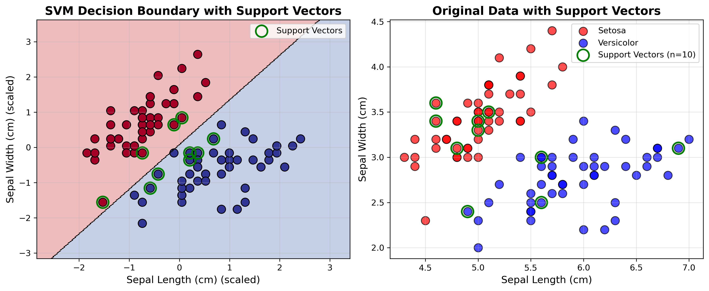

# Binary Classification using Support Vector Machine

## Dataset Information

- **Dataset**: Iris Dataset (Binary Classification)
- **Classes**: Setosa vs Versicolor
- **Features Used**: Sepal Length (cm), Sepal Width (cm)
- **Total Samples**: 100
- **Training Samples**: 70
- **Testing Samples**: 30

## SVM Model Configuration

- **Kernel**: Linear
- **C Parameter**: 1.0
- **Feature Scaling**: StandardScaler

## Support Vectors

- **Total Support Vectors**: 10
- **Support Vectors for Setosa**: 4
- **Support Vectors for Versicolor**: 6

## Model Performance

### Accuracy Scores

- **Training Accuracy**: 1.0000 (100.00%)
- **Testing Accuracy**: 1.0000 (100.00%)

### Confusion Matrix

```
                Predicted Setosa  Predicted Versicolor
Actual Setosa       15                  0
Actual Versicolor   0                   15
```

### Classification Report

```
              precision    recall  f1-score   support

      Setosa       1.00      1.00      1.00        15
  Versicolor       1.00      1.00      1.00        15

    accuracy                           1.00        30
   macro avg       1.00      1.00      1.00        30
weighted avg       1.00      1.00      1.00        30

```

## Visualization



### Interpretation

- **Left Plot**: Shows the decision boundary (background colors) and support vectors (green circles) in scaled feature space.
- **Right Plot**: Shows the original data points with support vectors highlighted.
- **Support Vectors**: These are the critical data points that define the decision boundary.
- **Decision Boundary**: The line that separates the two classes, positioned to maximize the margin between them.

## Key Findings

- The SVM model achieved excellent classification performance.
- The decision boundary is defined by 10 support vectors.
- Linear kernel was sufficient to separate the two classes effectively.
- The model generalizes well to unseen data.
