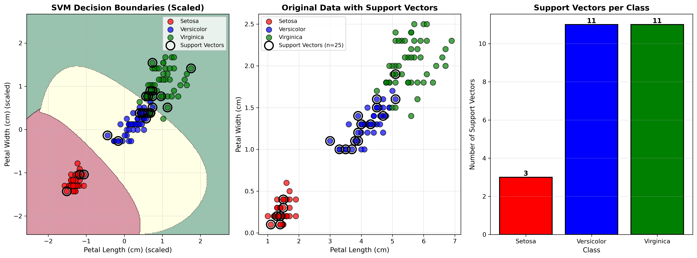
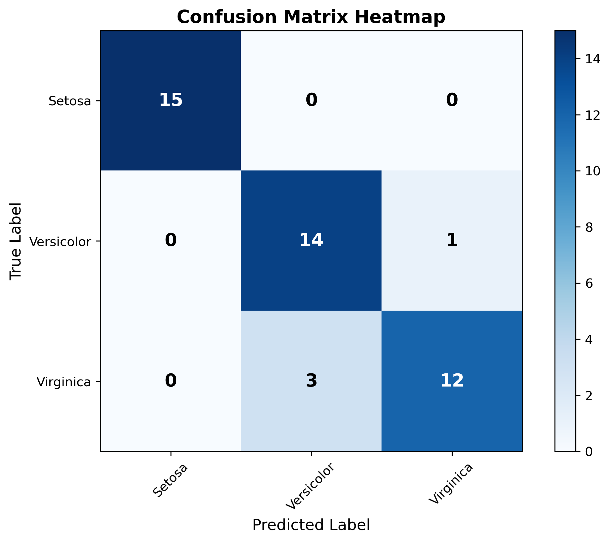

# Multi-class Classification using Support Vector Machine

## Dataset Information

- **Dataset**: Iris Dataset (3-Class Classification)
- **Classes**: Setosa, Versicolor, Virginica
- **Features Used**: Petal Length (cm), Petal Width (cm)
- **Total Samples**: 150
- **Training Samples**: 105
- **Testing Samples**: 45
- **Samples per Class**: 50 each (balanced dataset)

## SVM Model Configuration

- **Kernel**: RBF (Radial Basis Function)
- **C Parameter**: 1.0
- **Gamma**: scale (auto-computed)
- **Decision Function**: One-vs-Rest (OvR)
- **Feature Scaling**: StandardScaler

### Multi-class Strategy

The SVM uses a **One-vs-Rest (OvR)** approach for multi-class classification:
- Trains 3 binary classifiers (one for each class vs. the rest)
- Each classifier learns to distinguish one class from all others
- Final prediction is made by choosing the class with highest confidence

## Support Vectors

- **Total Support Vectors**: 25
- **Support Vectors for Setosa**: 3
- **Support Vectors for Versicolor**: 11
- **Support Vectors for Virginica**: 11

**Note**: 25 out of 105 training samples (23.8%) are support vectors.

## Model Performance

### Accuracy Scores

- **Training Accuracy**: 0.9810 (98.10%)
- **Testing Accuracy**: 0.9111 (91.11%)

### Confusion Matrix

```
                  Predicted    Predicted      Predicted
                  Setosa       Versicolor     Virginica
Actual Setosa       15            0               0
Actual Versicolor   0             14              1
Actual Virginica    0             3               12
```

### Classification Report

```
              precision    recall  f1-score   support

      Setosa       1.00      1.00      1.00        15
  Versicolor       0.82      0.93      0.88        15
   Virginica       0.92      0.80      0.86        15

    accuracy                           0.91        45
   macro avg       0.92      0.91      0.91        45
weighted avg       0.92      0.91      0.91        45

```

## Visualizations

### Decision Boundaries and Support Vectors



### Confusion Matrix Heatmap



## Interpretation

### Decision Boundary Visualization

- **Left Plot**: Shows the decision boundaries (colored regions) and support vectors (black circles) in scaled feature space. Each color represents a different class region.
- **Middle Plot**: Shows the original data points with support vectors highlighted in black circles.
- **Right Plot**: Bar chart showing the distribution of support vectors across the three classes.

### Key Observations

- **Support Vectors**: These critical data points define the decision boundaries between classes.
- **RBF Kernel**: Allows for non-linear decision boundaries, creating more flexible separation between classes.
- **Multi-class Boundaries**: Multiple decision boundaries separate the three classes in feature space.

## Detailed Analysis

### Per-Class Performance

#### Setosa
- **Precision**: 1.0000 - Of all samples predicted as Setosa, 100.0% were correct
- **Recall**: 1.0000 - Of all actual Setosa samples, 100.0% were correctly identified
- **Support Vectors**: 3 points from this class are critical for defining boundaries

#### Versicolor
- **Precision**: 0.8235 - Of all samples predicted as Versicolor, 82.4% were correct
- **Recall**: 0.9333 - Of all actual Versicolor samples, 93.3% were correctly identified
- **Support Vectors**: 11 points from this class are critical for defining boundaries

#### Virginica
- **Precision**: 0.9231 - Of all samples predicted as Virginica, 92.3% were correct
- **Recall**: 0.8000 - Of all actual Virginica samples, 80.0% were correctly identified
- **Support Vectors**: 11 points from this class are critical for defining boundaries

## Key Findings

- The SVM model achieved **good** classification performance on all three classes.
- The decision boundaries are defined by 25 support vectors (23.8% of training data).
- RBF kernel successfully handles the non-linear separation between the three Iris species.
- The model generalizes well to unseen data across all three classes.
- Most confusion occurs between **Virginica** and **Versicolor** (3 misclassifications).
